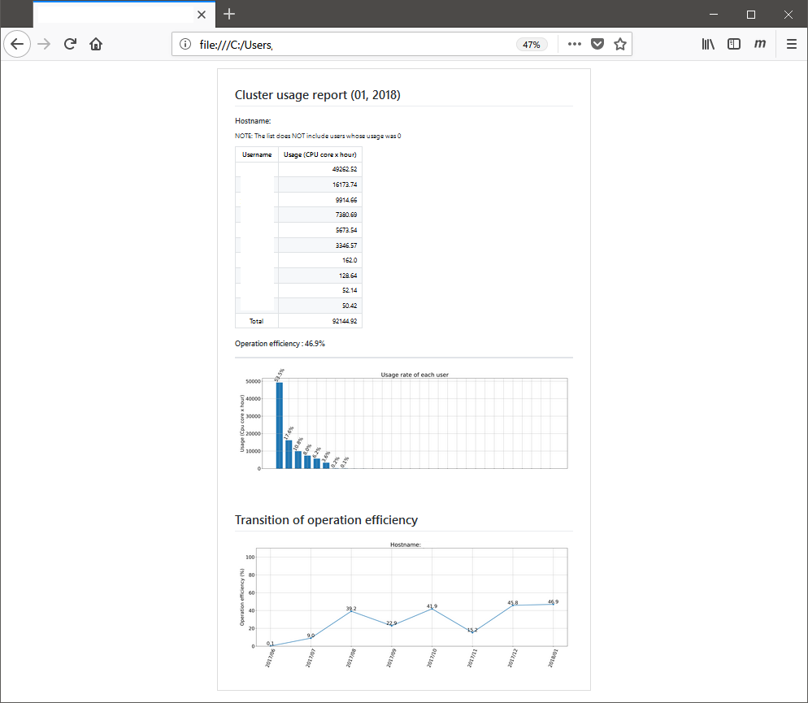

# cluster_usage_report
計算機クラスターの使用率レポートを作るツール

## Demo


## 利用想定
* Torque で運用されているクラスターがレポート対象。
* 管理者(root)権限になれる人が使う。
* クラスターに`ssh`できる Linux 環境で作業を行う。
* Reqd. `python --version` >= 3.6

## 準備
### (1) Linux 環境を用意
:point_right: [シス管系女子 - 漫画でわかるWSL](http://system-admin-girl.com/comic/begins/sp-wsl/) など。

### (2) conda をインストール
※ anaconda を入れたことがあり、`python --version`の結果が`Python 3.6.X :: Anaconda, Inc.`（もしくはそれ以上のバージョン）なら**スキップして準備(3)へ。**
* python のライブラリをいくつか呼んでいる。
* それらをまるっと導入する conda をインストールする。

:point_right: [インストール方法](https://github.com/kottn/begin_conda) の「**Step 3**」までやる
* 特別に`conda install`するものはない。anaconda の基本パッケージだけでよい。

### (3) このリポジトリを`clone`する
```
$ cd; git clone https://github.com/kottn/cluster_usage_report
$ tree cluster_usage_report
cluster_usage_report/
|-- 01_Accounting.py  # 指定月のユーザー利用率のグラフ(Usage_yyyy_mm.png)、レポート(Usage_yyyy_mm.md)を作る
|-- 02_UsageTrans.py  # これまでの稼働率の推移グラフ(Usage_transision.png)を作る
`-- README.md         # This file
```

## 使い方
### (Step 1) クラスター情報を入力し、指定月の利用集計をする。
* `$ vi 01_Accounting.py`
```
####### INP. #######
HOST    = 'serverhost' # 対象のヘッドノードのホスト名（もしくはIP）
allcore = 600          # クラスターのMAXプロセス数（クラスター内で qstat -Q すれば確認できる）
YY      = '2018'       # レポートする年
MM      = '01'         # レポートする月
####################
```

* 実行
```
$ python 01_Accounting.py    # rootパスワードを2回聞かれるので入力。
```

* 結果
```
.
.
.
Operation efficiency: XX.X %    # 稼働率（月平均）
$
```

### (Step 2) Operation efficiency を追記し推移グラフを作る。
* `$ vi 02_UsageTrans.py`
```
####### INP. #######
HOST = 'serverhost'    # Step 1 に揃える
####################
```

* 直後のリストに、Operation efficiency の値を追記していく。
```
if HOST == 'serverhost':
    d = {'2016/09': 27.8,\
         '2016/10': 104.9,\
         '2016/11': 56.5,\
         '2016/12': 99.9,\
         '2017/01': 72.1,\
         '2017/02': 18.5,\
         '2017/03': 56.2,\
         '2017/04': 58.8,\
         '2017/05': 69.3,\
         '2017/06': 39.9,\
         '2017/07': 30.3,\
         '2017/08': 41.9,\
         '2017/09': 48.4,\
         '2017/10': 79.8,\
         '2017/11': 28.8,\
         '2017/12': 50.2,\
         '2018/01': XX.X}     # 毎月追記していく
```

* 実行
```
$ python 02_UsageTrans.py
```

## 生成物
```
cluster_usage_report/
|-- 01_Accounting.py
|-- 02_UsageTrans.py
|-- myhost/
|   |-- Usage_2018_01.md      # [New!] 配布用レポート
|   |-- Usage_2018_01.txt     # [New!] 簡易レポート
|   |-- Usage_2018_01.png     # [New!] ユーザー別利用率グラフ
|   `-- Usage_transition.png  # [New!] 推移グラフ
|-- logfiles/
|   `-- myhost/
|       `-- 2018_01/          # [New!] ログファイル
`-- README.md*
```

## 印刷
1. Windows に今回の生成物（`Usage_*`）を持ってくる。
1. `*.md`（Markdownファイルといいます。中身はテキストです。）を何らかの方法で表示。
1. 例えば簡単なのは Markdown Viewer アドオン。（[Firefoxユーザー](https://addons.mozilla.org/en-US/firefox/addon/markdown-viewer-chrome/) / [Chromeユーザー](https://chrome.google.com/webstore/detail/markdown-viewer/ckkdlimhmcjmikdlpkmbgfkaikojcbjk) ※ Chrome は追加後に、拡張機能設定で「ファイルのURLへのアクセスを許可する」にチェック）
1. `*.md` ファイルをブラウザにドラッグ＆ドロップすると、レポートが表示される。
1. あとはPDFに印刷するなりする。
1. 60% くらいの倍率で印刷すると A4 に収まる。

おしまい。
